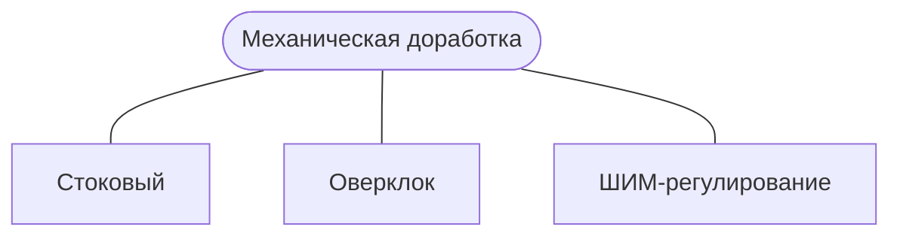

# OLTA-5mW-405nm-laser
## Использование лазерной указки в станках с ЧПУ

 

### Механическая доработка
Раскрутил указку. Часть с лазером бокорезами и надфилем "дорабатал". Получил следующее:

 

### Стоковое использование
На пружинку подаем GND, на корпус +3В. "Зажимаем"/замыкаем кнопку. Настраиваем фокус широкой отверткой. Шлиц под отвертку, как будто не настолько глубокий, чтобы отвертка могла поцарамать линзу. Если не хочется рисковать, то можно использовать какой-нибудь "рогатый" инструмент.

### Оверклокинг

 

