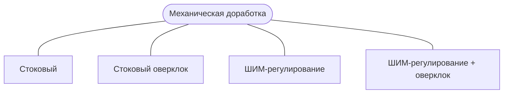

# OLTA-5mW-405nm-laser
## Использование лазерной указки в станках с ЧПУ

 

```mermaid
flowchart

	n18@{ shape: "stadium", label: "Механическая доработка" }
	n18 --- n12["Стоковый"]
	n18 --- n13["Стоковый оверклок"]
	n18 --- n14["ШИМ-регулирование"]
	n18 --- n17["ШИМ-регулирование + оверклок"]
```
