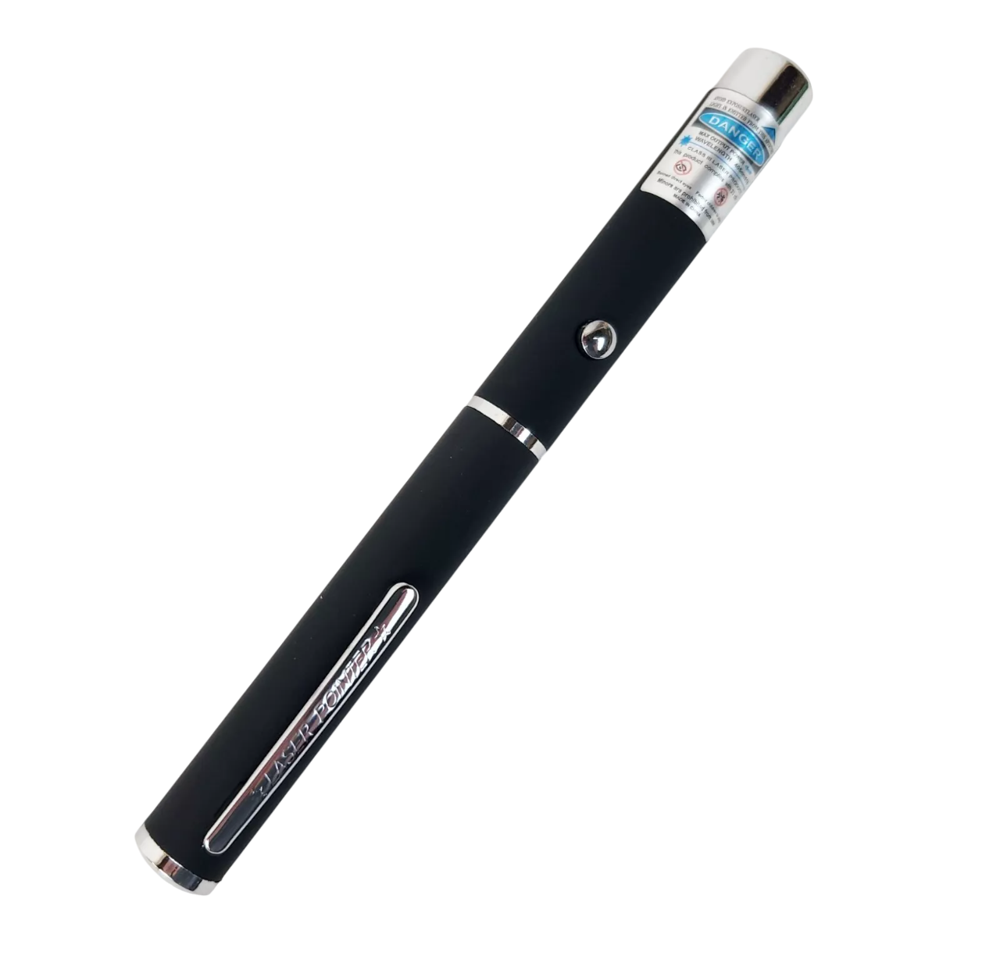
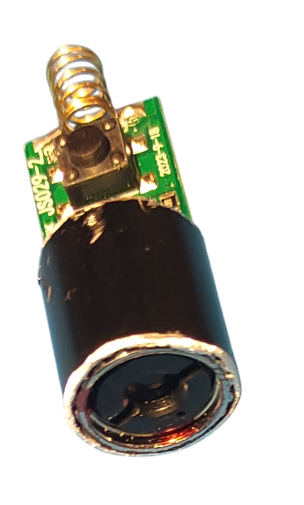
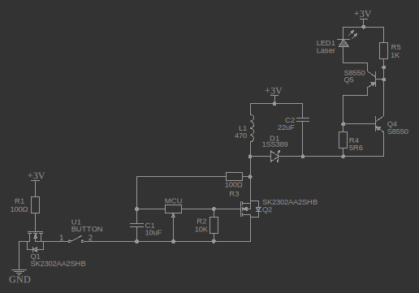
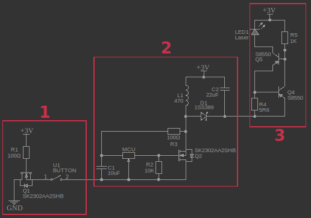
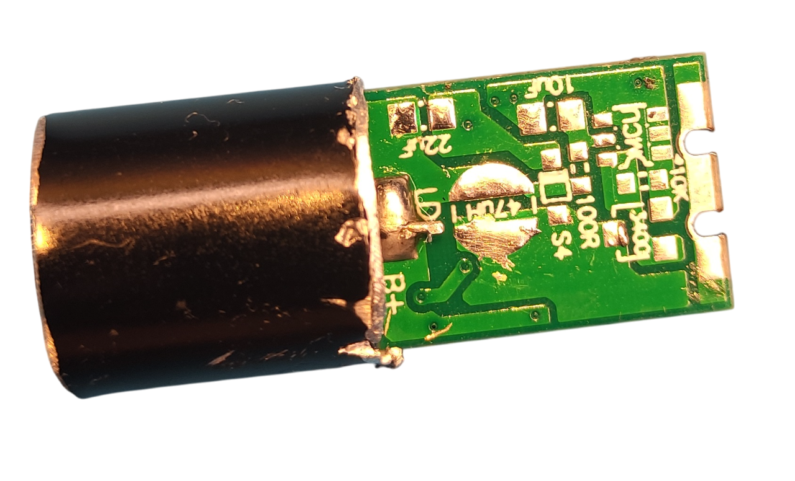
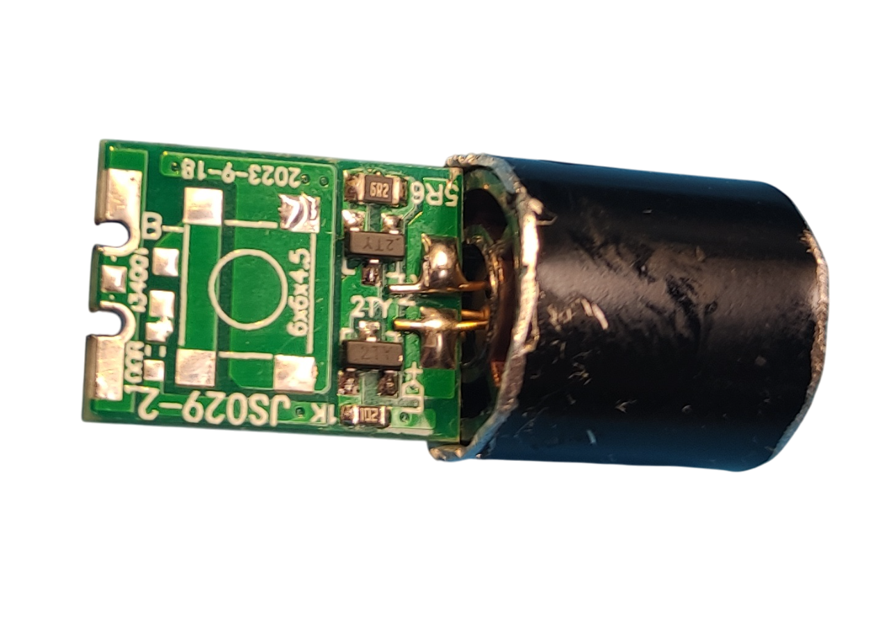
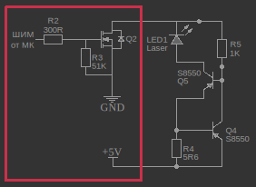

# OLTA-5mW-405nm-laser
## Использование лазерной указки в станках с ЧПУ

 

### Механическая доработка
Раскрутил указку. Часть с лазером бокорезами и надфилем "дорабатал". Получил следующее:

 

### Стоковое использование
На пружинку подаем GND, на корпус +3В. "Зажимаем"/замыкаем кнопку. Настраиваем фокус широкой отверткой. Шлиц под отвертку, как будто не настолько глубокий, чтобы отвертка могла поцарапать линзу. Если не хочется рисковать, то можно использовать какой-нибудь "рогатый" инструмент.

### Оверклокинг
Я не занимался этим, но мыслями поделюсь. Надо понимать, что ресурс лазера при использовании его в "разогнаном" состоянии может сильно уменьшиться. Предположу, что ток лазера можно увеличить с помощью резистора R4.

 

### ШИМ-регулирование

Условно схему можно разделить на три блока:

 

1. Защита от переполюсовки и кнопка.
2. DC/DC-преобразователь повышающий с 3 Вольт на 8 Вольт.
3. Токовый драйвер лазера и сам лазер.

Сдуваем первые два блока и получаем следующее:

 

 

К оставшейся схеме добавляем MOSFET NPN транзистор с logic level и пару резисторов. Я взял с VRM от убитой материнской платы транзистор 7030AL. Получилось с огромным запасом. Пришлось порезать некоторые дорожки и полигоны скальпелем. 

 

